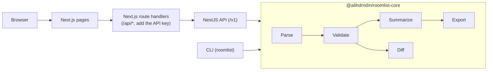

# roomlist-kit: hotel rooming list validator and OPERA / Maestro PMS import converter

**Validate a hotel rooming list (CSV or Excel) against the room block, then convert it into the import file Oracle OPERA 5, OPERA Cloud or Maestro PMS expects.** Open-source TypeScript: a library, a CLI, a REST API and a web app. No database, and nothing you upload is stored.

[](https://github.com/alihdrndm/roomlist-kit/actions/workflows/ci.yml)

## The problem

A group rooming list is where event budgets quietly leak. The planner keeps it in a spreadsheet: who sleeps where, which nights, who shares with whom, all inside a contracted room block. Every hotel system wants that list in a different shape. OPERA 5 takes XML, OPERA Cloud takes Excel with "Line" and "Sharer" columns, and Maestro takes a CSV with `BUILDING/ROOMTYPE` codes. So someone re-types it by hand, and the mistakes show up at the front desk: a stay outside the block dates, a sharer who points at nobody, the same guest booked twice, a room type the block never had. roomlist-kit catches those before the hotel does, counts the room nights per night and per room type, and writes a file the hotel can import as-is. When the client sends "v7_FINAL_really.xlsx", it shows exactly what changed since v6.

## What roomlist-kit checks and converts

| | |
|---|---|
| **Reads** | CSV (comma, semicolon or tab) and Excel `.xlsx`, with messy headers ("Surname", "Check-In", "Date In"…) mapped to known fields, and US or European date order |
| **Validates** | 31 numbered rules: missing names, impossible dates, stays outside the block or its shoulder days, unknown room types, over-occupancy, sharers who point at nobody or at another sharer, duplicate guests, and more |
| **Summarizes** | Guests, rooms, people, **room nights**, rooms per night and per room type: the numbers you compare against the contract |
| **Converts** | Oracle OPERA 5 (XML), Oracle OPERA Cloud (Excel), Maestro PMS (CSV), plus canonical JSON and CSV |
| **Compares** | Two versions of a list: who was added, removed or changed, and the room-night difference |

Every issue comes with its row number, a stable code (`R004 STAY_OUTSIDE_BLOCK`) and a plain-English message, so you can fix the spreadsheet rather than guess.

**Built to take hostile files.** Uploads are capped at 5 MB and 5,000 guest rows. The readers are written to fail fast: 2.6 million one-cell CSV lines are refused in 6 ms, and a forged Excel zip hiding 400 MB behind a 1 KB claim is refused in 142 ms. The test suite has 514 tests, and the core library has 98% line coverage.

## Quick start

```sh
git clone https://github.com/alihdrndm/roomlist-kit.git
cd roomlist-kit
pnpm install
pnpm dev
```

Then open:

- http://localhost:3010 for the web app.
- http://localhost:4010/docs for the API documentation.

You need Node 24 and pnpm (`corepack enable`). See [CONTRIBUTING.md](CONTRIBUTING.md).

Prefer Docker? This builds and starts the same two services (API key `local-dev-key`):

```sh
docker compose up --build
```

## Try it

Run these from the repository root in a POSIX shell (macOS, Linux, Git Bash). The CLI examples need a build first (`pnpm build`). The API examples need the Docker stack (`docker compose up --build`), which sets the API key `local-dev-key`.

**1. Validate a list with the CLI**

```sh
node packages/cli/dist/index.js validate fixtures/input/we1.csv --block fixtures/blocks/tech26.json
```

```text
No issues found.

Summary
  Entries         4
  Primaries       3
  Sharers         1
  Rooms           3
  People          6
  Room nights     9
  First arrival   2026-11-10
  Last departure  2026-11-14

By room type (rooms, room nights)
  KING  2  5
  QQ    1  4

Rooms per night
  2026-11-10  2
  2026-11-11  3
  2026-11-12  3
  2026-11-13  1
```

**2. Compare two versions of a list with the CLI**

```sh
node packages/cli/dist/index.js diff fixtures/input/list-v1.csv fixtures/input/list-v2.csv
```

```text
Diff summary
  Added      3
  Removed    2
  Changed    4
  Unchanged  10
  Room nights  28 -> 32 (+4)

Added (3)
  + line 17: Pereira, Quinn (2026-11-11 to 2026-11-13)
  + line 18: Rossi, Sana (2026-11-12 to 2026-11-14)
  + line 19: Sorensen, Tomas (2026-11-10 to 2026-11-12)

Removed (2)
  - line 13: Kowalski, Dana (2026-11-13 to 2026-11-14)
  - line 16: Novak, Petra (2026-11-10 to 2026-11-11)

Changed (4)
  ~ line 5: Delacroix, Remy (2026-11-11 to 2026-11-14)
      departureDate: 2026-11-13 → 2026-11-14
  ~ line 7: Fairbanks, Lena (2026-11-11 to 2026-11-14)
      sharesWith: Eze, Tobias → Lopez, Marco
  ~ line 8: Gunnarsson, Pia (2026-11-12 to 2026-11-14)
      roomType: QQ → KING
  ~ line 9: Smith, John (2026-11-12 to 2026-11-13)
      departureDate: 2026-11-14 → 2026-11-13
```

**3. Convert to a Maestro import file through the API**

```sh
curl -s -H "x-api-key: local-dev-key" \
  -F "file=@fixtures/input/we1.csv" \
  -F "block=<fixtures/blocks/tech26.json" \
  -F "target=maestro-csv" \
  -F 'targetOptions={"buildingCode":"MAIN"}' \
  http://localhost:4010/v1/rooming-lists/convert
```

```text
1,48213,Ada,Okafor,,MAIN/KING,2026-11-10,2026-11-13,1,0,0,u
2,48213,Jonas,Lindqvist,,MAIN/QQ,2026-11-10,2026-11-14,1,0,0,u
3,48213,Elena,Marchetti,2,MAIN/QQ,2026-11-10,2026-11-14,1,0,0,u
4,48213,Hiro,Tanaka,,MAIN/KING,2026-11-11,2026-11-13,2,1,0,u
```

**4. Call the API without the key**

```sh
curl -s -F "file=@fixtures/input/we1.csv" http://localhost:4010/v1/rooming-lists/validate
```

```json
{"type":"https://github.com/alihdrndm/roomlist-kit/blob/main/docs/ERRORS.md#UNAUTHORIZED","title":"Unauthorized","status":401,"detail":"A valid x-api-key header is required.","code":"UNAUTHORIZED","instance":"01a11588-99ad-77aa-b256-46f886a63808"}
```

`instance` is the request id, so it is different on every call. Every error code is described in [docs/ERRORS.md](docs/ERRORS.md).

## How it works



All the real work is in `@alihdrndm/roomlist-core`, a plain TypeScript library with no server in it. It parses the file, validates every entry against the block context, summarizes room nights, and then either exports the list in a target format or diffs it against another list. The CLI and the NestJS API are thin wrappers that read a file, call core, and print or return the result. The web app never calls the API from the browser: its Next.js route handlers do, so the API key stays on the server. Nothing is stored; each request is processed in memory.

The REST API has four endpoints, documented with OpenAPI at `/docs`:

| Endpoint | Does |
|----------|------|
| `POST /v1/rooming-lists/validate` | Issues and summary for one list (always 200; the report is the product) |
| `POST /v1/rooming-lists/convert` | The import file for a chosen target, or a 422 listing what blocks it |
| `POST /v1/rooming-lists/diff` | Added, removed and changed guests between two lists |
| `GET /v1/formats` | Every target, its options, and what is verified or assumed |

Errors are always `application/problem+json` with a stable `code`; see [docs/ERRORS.md](docs/ERRORS.md).

## Verified vs assumed

Field names and formats were taken from public vendor documentation, not tested against a running hotel system. [docs/ASSUMPTIONS.md](docs/ASSUMPTIONS.md) lists every unverified item (A1 to A8) with how to check it and what to change.

- OPERA 5: the XML root and record element names (if your template differs, set the `rootElement` and `recordElement` options), the date of birth format, and how sharers are counted.
- OPERA Cloud: the Excel heading labels, dates written as text, and the email type code.
- Maestro: the column order and header row, and the gender code. Check each against your hotel's own template before a real import.

## FAQ

### How do I import a rooming list into OPERA Cloud?
Open the web app, load your file, press Validate, and fix any errors it lists. Then choose "Oracle OPERA Cloud (Excel)" and download. In OPERA Cloud, use the rooming list import; if a heading is not recognized, OPERA Cloud lets you map it by hand.

### Which columns does my rooming list need?
Three: a last name (or one full-name column, which is split for you), an arrival date and a departure date. Everything else (room type, sharer, email, adults, children…) is optional and checked when present. Extra columns are reported as warnings, not errors.

### Does it store or log guest data?
No. Files are processed in memory for one request and never written to disk. Logs hold the request id, method, path, status and user agent, never file contents. There is no database. Details in [SECURITY.md](SECURITY.md).

### Has it been tested against a live OPERA or Maestro system?
No, and the repo says so. Formats follow the vendors' public documentation, and every detail that could not be verified is listed with an ID in [docs/ASSUMPTIONS.md](docs/ASSUMPTIONS.md) and on the web app's Formats page. Check those against your property's template before a real import.

### Can I add another PMS?
Yes. Each target is one file in `packages/core/src/export/`, plus its ID and a registry entry. The CLI, the API and the web app (including its option form) pick it up from there. [docs/ARCHITECTURE.md](docs/ARCHITECTURE.md) shows where everything lives.

### Can I deploy it?
Yes. It runs anywhere Docker runs (`compose.yaml`), and an AWS setup with SST is included but never deployed for you. [docs/DEPLOY.md](docs/DEPLOY.md) lists every resource and which ones bill by the hour.

## Documentation

- [docs/ARCHITECTURE.md](docs/ARCHITECTURE.md): package map, request flow, where each rule is implemented
- [docs/ERRORS.md](docs/ERRORS.md): every API error code
- [docs/ASSUMPTIONS.md](docs/ASSUMPTIONS.md): what is verified and what is assumed, per PMS
- [docs/DECISIONS.md](docs/DECISIONS.md): every design decision, dated
- [docs/DEPLOY.md](docs/DEPLOY.md): optional AWS deployment
- [CONTRIBUTING.md](CONTRIBUTING.md) and [SECURITY.md](SECURITY.md)

## Roadmap

- More PMS targets: Mews, Cloudbeds, Stayntouch, Protel, Infor HMS.
- Confirmation-number import: merge a hotel's confirmation file back into the list.
- Push to OPERA Cloud through Oracle Hospitality Integration Platform instead of a file.
- Saved column mappings per hotel.
- Publish `@alihdrndm/roomlist-core` and the CLI to npm.

## License

MIT. See [LICENSE](LICENSE).
