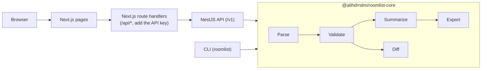

# roomlist-kit

roomlist-kit takes a messy hotel rooming list (CSV or Excel), tells the planner exactly what is wrong with it, and converts it into the import file each hotel's property-management system expects.

[](https://github.com/alihdrndm/roomlist-kit/actions/workflows/ci.yml)

## The problem

An event planner keeps the rooming list, the list of who sleeps where in the room block, in a spreadsheet. Every hotel system wants that list in a different shape. Oracle OPERA 5 imports XML with fixed field names, OPERA Cloud imports Excel with "Line" and "Sharer" columns, and Maestro imports a CSV with `BUILDING/ROOMTYPE` codes. Planners re-type and re-format by hand, and the mistakes show up at check-in: a stay outside the block dates, a sharer who points at nobody, the same guest listed twice, or a room type the block does not have. roomlist-kit checks the list against the block, reports each issue with the row it is on, and counts the room nights per night and per room type. It then writes the file the hotel's system can import. It can also compare two versions of a list, so you can see what changed since you last sent it.

## Quick start

```sh
git clone https://github.com/alihdrndm/roomlist-kit.git
cd roomlist-kit
pnpm install
pnpm dev
```

Then open:

- http://localhost:3010 for the web app.
- http://localhost:4010/docs for the API documentation.

You need Node 24 and pnpm (`corepack enable`). See [CONTRIBUTING.md](CONTRIBUTING.md).

Prefer Docker? This builds and starts the same two services (API key `local-dev-key`):

```sh
docker compose up --build
```

## Try it

Run these from the repository root in a POSIX shell (macOS, Linux, Git Bash). The CLI examples need a build first (`pnpm build`). The API examples need the Docker stack (`docker compose up --build`), which sets the API key `local-dev-key`.

**1. Validate a list with the CLI**

```sh
node packages/cli/dist/index.js validate fixtures/input/we1.csv --block fixtures/blocks/tech26.json
```

```text
No issues found.

Summary
  Entries         4
  Primaries       3
  Sharers         1
  Rooms           3
  People          6
  Room nights     9
  First arrival   2026-11-10
  Last departure  2026-11-14

By room type (rooms, room nights)
  KING  2  5
  QQ    1  4

Rooms per night
  2026-11-10  2
  2026-11-11  3
  2026-11-12  3
  2026-11-13  1
```

**2. Compare two versions of a list with the CLI**

```sh
node packages/cli/dist/index.js diff fixtures/input/list-v1.csv fixtures/input/list-v2.csv
```

```text
Diff summary
  Added      3
  Removed    2
  Changed    4
  Unchanged  10
  Room nights  28 -> 32 (+4)

Added (3)
  + line 17: Pereira, Quinn (2026-11-11 to 2026-11-13)
  + line 18: Rossi, Sana (2026-11-12 to 2026-11-14)
  + line 19: Sorensen, Tomas (2026-11-10 to 2026-11-12)

Removed (2)
  - line 13: Kowalski, Dana (2026-11-13 to 2026-11-14)
  - line 16: Novak, Petra (2026-11-10 to 2026-11-11)

Changed (4)
  ~ line 5: Delacroix, Remy (2026-11-11 to 2026-11-14)
      departureDate: 2026-11-13 → 2026-11-14
  ~ line 7: Fairbanks, Lena (2026-11-11 to 2026-11-14)
      sharesWith: Eze, Tobias → Lopez, Marco
  ~ line 8: Gunnarsson, Pia (2026-11-12 to 2026-11-14)
      roomType: QQ → KING
  ~ line 9: Smith, John (2026-11-12 to 2026-11-13)
      departureDate: 2026-11-14 → 2026-11-13
```

**3. Convert to a Maestro import file through the API**

```sh
curl -s -H "x-api-key: local-dev-key" \
  -F "file=@fixtures/input/we1.csv" \
  -F "block=<fixtures/blocks/tech26.json" \
  -F "target=maestro-csv" \
  -F 'targetOptions={"buildingCode":"MAIN"}' \
  http://localhost:4010/v1/rooming-lists/convert
```

```text
1,48213,Ada,Okafor,,MAIN/KING,2026-11-10,2026-11-13,1,0,0,u
2,48213,Jonas,Lindqvist,,MAIN/QQ,2026-11-10,2026-11-14,1,0,0,u
3,48213,Elena,Marchetti,2,MAIN/QQ,2026-11-10,2026-11-14,1,0,0,u
4,48213,Hiro,Tanaka,,MAIN/KING,2026-11-11,2026-11-13,2,1,0,u
```

**4. Call the API without the key**

```sh
curl -s -F "file=@fixtures/input/we1.csv" http://localhost:4010/v1/rooming-lists/validate
```

```json
{"type":"https://github.com/alihdrndm/roomlist-kit/blob/main/docs/ERRORS.md#UNAUTHORIZED","title":"Unauthorized","status":401,"detail":"A valid x-api-key header is required.","code":"UNAUTHORIZED","instance":"01a11588-99ad-77aa-b256-46f886a63808"}
```

`instance` is the request id, so it is different on every call. Every error code is described in [docs/ERRORS.md](docs/ERRORS.md).

## How it works



All the real work is in `@alihdrndm/roomlist-core`, a plain TypeScript library with no server in it. It parses the file, validates every entry against the block context, summarizes room nights, and then either exports the list in a target format or diffs it against another list. The CLI and the NestJS API are thin wrappers that read a file, call core, and print or return the result. The web app never calls the API from the browser: its Next.js route handlers do, so the API key stays on the server. Nothing is stored; each request is processed in memory.

## Verified vs assumed

Field names and formats were taken from public vendor documentation, not tested against a running hotel system. [docs/ASSUMPTIONS.md](docs/ASSUMPTIONS.md) lists every unverified item (A1 to A8) with how to check it and what to change.

- OPERA 5: the XML root and record element names, the date of birth format, and how sharers are counted.
- OPERA Cloud: the Excel heading labels, dates written as text, and the email type code.
- Maestro: the column order and header row, and the gender code. Check each against your hotel's own template before a real import.

## Roadmap

- More PMS targets: Mews, Cloudbeds, Stayntouch, Protel, Infor HMS.
- Confirmation-number import: merge a hotel's confirmation file back into the list.
- Push to OPERA Cloud through Oracle Hospitality Integration Platform instead of a file.
- Saved column mappings per hotel.
- Publish `@alihdrndm/roomlist-core` and the CLI to npm.
- Per-user rate limits for web traffic (today web users share limits per server address after deployment).

## License

MIT. See [LICENSE](LICENSE).
