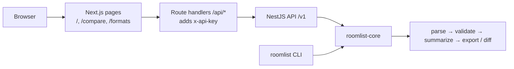

# Architecture

roomlist-kit is one library with three front doors. All the domain logic lives in `packages/core`, and the CLI, the HTTP API and the web app only move bytes in and out of it.

## Package and app map

| Path | Package | Role | Depends on |
|------|---------|------|------------|
| `packages/core` | `@alihdrndm/roomlist-core` | Parse, validate, summarize, export and diff rooming lists. Pure TypeScript, no Node-only APIs in the domain code. | zod, fflate, exceljs (writing), xmlbuilder2, csv-stringify |
| `packages/cli` | `@alihdrndm/roomlist-cli` | `roomlist` command: validate, convert, diff, formats. | core, commander |
| `apps/api` | `api` | NestJS HTTP API on port 4010 (`/v1/...`, `/healthz`, `/readyz`, `/docs`). | core, NestJS, nestjs-pino, helmet, throttler, swagger |
| `apps/web` | `web` | Next.js app on port 3010: `/`, `/compare`, `/formats`, plus `/api/*` route handlers. | core (types only), Next.js, React, Tailwind |
| `infra/`, `sst.config.ts` | — | SST v3 definitions (API as a Fargate service, web as `sst.aws.Nextjs`). Deploy-ready, not deployed. | sst |
| `fixtures/` | — | Synthetic input files, blocks and golden expected outputs. | — |

## Request flow

1. The browser posts a multipart form to a Next.js route handler (`apps/web/src/app/api/*/route.ts`). The browser never sees the API URL or key.
2. `apps/web/src/lib/proxy.ts` checks `Content-Length` (5 MB per file plus 1 MB), adds `x-api-key`, forwards to the API, and passes back only an allow-listed set of headers.
3. In the API, `ApiKeyGuard` runs before the upload is read. The throttler limits each client to 120 requests per minute, then multer reads the file into memory.
4. `rooming-lists.service.ts` calls core: `parseRoomingList` → `validateRoomingList` → `summarize`, then `exportRoomingList` or `diffRoomingLists`.
5. Any error becomes one `application/problem+json` body in `problem.filter.ts`.

## Where each rule from HANDOFF.md lives

| Rule | File |
|------|------|
| Data shapes (Zod, single source of truth) | `packages/core/src/model.ts`, `summarize.ts`, `diff.ts`, `export/types.ts`, `export/registry.ts` |
| Calendar dates as `YYYY-MM-DD`, all date math | `packages/core/src/plain-date.ts` |
| File type detection | `packages/core/src/parse/detect-format.ts` |
| CSV reading (own linear reader, yields every 256 KB) | `packages/core/src/parse/csv.ts`, `parse/yield.ts` |
| Excel reading (bounded unzip, lazy shared strings) | `packages/core/src/parse/xlsx.ts`, `xlsx-parts.ts`, `xlsx-sheet.ts`, `xlsx-xml.ts`, `zip.ts` |
| Header row and column mapping | `packages/core/src/parse/headers.ts` |
| Cell normalisation and date parsing (MDY/DMY) | `packages/core/src/parse/normalize.ts`, `parse/dates.ts` |
| Parsing pipeline, F-rules, row limit | `packages/core/src/parse/parse.ts` |
| Rule catalogue (IDs, codes, severities) | `packages/core/src/issues.ts` |
| R- and W-rules | `packages/core/src/validate/rules.ts`, `validate/validate.ts` |
| Summary (room nights, by night, by room type) | `packages/core/src/summarize.ts` |
| Export targets, provenance, X001 preconditions | `packages/core/src/export/*.ts` (one file per target), `export/registry.ts` |
| Guest matching for diff (name key, same-name guests) | `packages/core/src/diff.ts`, `name-key.ts` |
| CLI commands and exit codes | `packages/cli/src/commands/*.ts`, `packages/cli/src/index.ts` |
| `process.env` (API) | `apps/api/src/config.ts` only |
| `process.env` (web) | `apps/web/src/env.ts` only |
| API key check (SHA-256 + `timingSafeEqual`) | `apps/api/src/api-key.guard.ts` |
| Error codes and problem+json | `apps/api/src/errors.ts`, `problem.filter.ts`, `docs/ERRORS.md` |
| Request id, logging without bodies | `apps/api/src/request-id.ts`, `app.module.ts` (nestjs-pino serializers) |
| Rate limit, `TRUST_PROXY`, helmet | `apps/api/src/app.module.ts`, `app.ts` |
| Multipart parts and their validation | `apps/api/src/schemas.ts`, `require-file-parts.ts`, `rooming-lists.controller.ts` |
| OpenAPI document and `/docs` | `apps/api/src/openapi.ts`, `swagger.ts` |
| Health endpoints | `apps/api/src/health.controller.ts` |
| Web proxy (bounded upload, header allow-list) | `apps/web/src/lib/proxy.ts` |
| Web pages | `apps/web/src/app/validate-convert.tsx`, `compare/compare.tsx`, `formats/page.tsx` |
| Option inputs from JSON Schema | `apps/web/src/lib/forms.ts` |
| Containers | `apps/api/Dockerfile`, `apps/web/Dockerfile`, `compose.yaml` |
| Cloud resources | `sst.config.ts`, `infra/api.ts`, `infra/web.ts` (see `docs/DEPLOY.md`) |
| CI | `.github/workflows/ci.yml` |

## Tests

| Kind | Where | Run by |
|------|-------|--------|
| Core unit, property and golden-file tests | `packages/core/src/**/*.test.ts` | `pnpm test` |
| CLI tests against the built binary | `packages/cli/src/cli.e2e.test.ts`, `format.test.ts` | `pnpm test` |
| API unit and e2e tests | `apps/api/src/*.test.ts`, `apps/api/test/*.e2e.test.ts` | `pnpm test`, `pnpm test:e2e` |
| Web unit tests | `apps/web/src/**/*.test.ts` | `pnpm test` |
| Playwright smoke and keyboard tests | `apps/web/e2e` | `pnpm test:e2e` |
